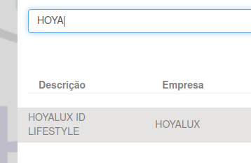
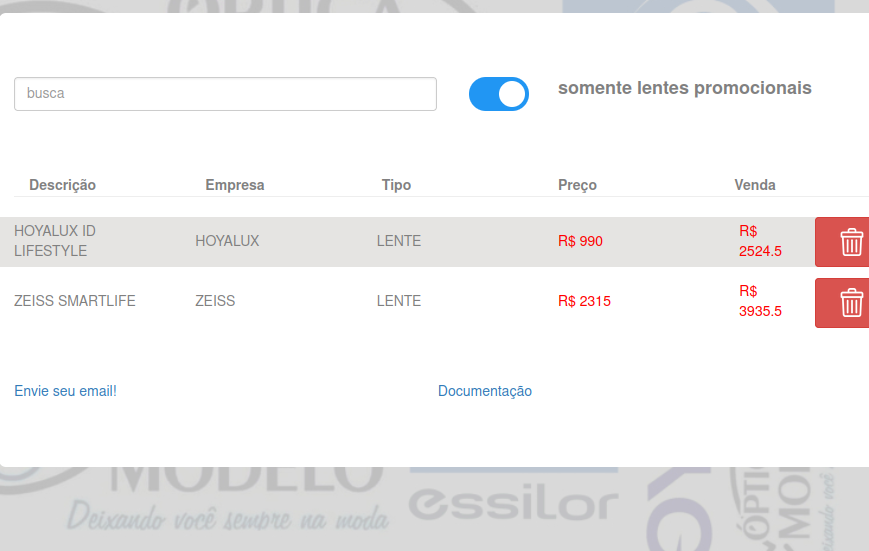
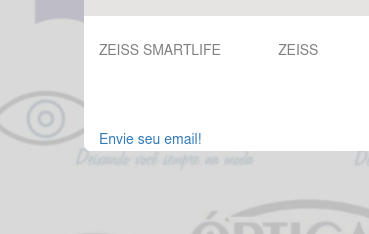
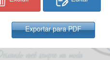
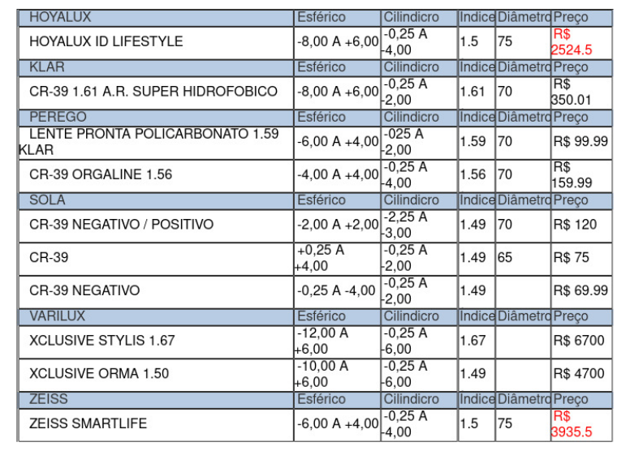
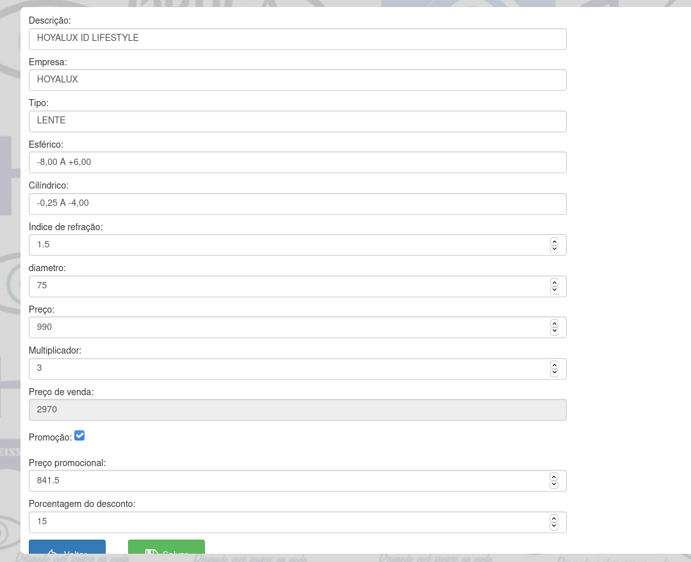
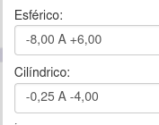
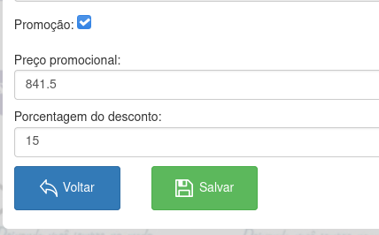

# Documentação oficial da tabela de preço

## Seções 

* [Tabela de preço](#tabela-preco)
* [Nova lente](#nova-lente)

### Tabela de preço
   A tabela de preço contém todas as suas lentes cadastradas. 

   Você pode pode fazer uma pesquisa como vc quiser:  
   	 
   Na barra de pesquisa você pode buscar o que vc quiser: Empresa, nome, preço... 

   Você pode querer exibir somente lentes promocionais:
   	 
   Esse switch caso você o habilite vai filtrar a lista de lentes somente com preço promocional.  

   Caso você tenha algum problema, além de me mandar mensagem, outra coisa que pode te auxiliar é o botão de envio de email:  
   	 

   Esse botão vai abrir uma caixa de diálogo onde você pode digitar o que está ocasionando seu problema:   
   	 

   O botão de exportar PDF vai pegar toda a sua tabela de preço e transformar em um arquivo PDF:   
   	 

   Este é um exemplo de PDF:  
   	 

   Os botões de **excluir** e de **editar** já são autoexplicativos. 

### Nova lente
   Esse é um exemplo do cadastro de uma nova lente preenchido:  
   	 

   Vamos ver alguns detalhes...

   Os campos **Esférico** e **Cilíndrico** devem ser preenchidos da seguinte forma:  
   	 

   O campo **Preço de venda** você não vai conseguir preencher, o que vc deve fazer é colocar um Multiplicador no campo a cima. Ele vai calcular o preço de venda altomaticamente.

   Todos os campos que você preencher vão ser cadastrados com letra maiúscula, mesmo que você cadastre com letras minúscula. 

   **É extremamente importante que você acerto o nome da Empresa, é isso que vai determinar de qual empresa aquela lente pertence**
   Caso você cadastre com um nome de empresa errado, por exmplo:\ Hooyalux (com dois 'O's) ele vai assumir que Hooyalux é uma empresa diferente da Hoyalux.

   Seção da promoção  
   	 
   
   Essa seção é exibida quando você seleciona o check_box [x] 
   Agora você tem duas opções, ou coloca uma porcentagem de desconto (como '15' por cento) ou coloca um preço promocioal.
   **Atente-se de que você não deve colocar o simbolo de porcentagem % , somente o valor numérico**

   Independente do qual vc colocar ele vai calcular o outro automaticamente. Por exemplo, se você colocar 10 por cento de desconto em uma lente com preço de 100,00 reais, ele vai calcular, sozinho, o preço promocional (no caso, 90,00). O inverse também é verdade.

